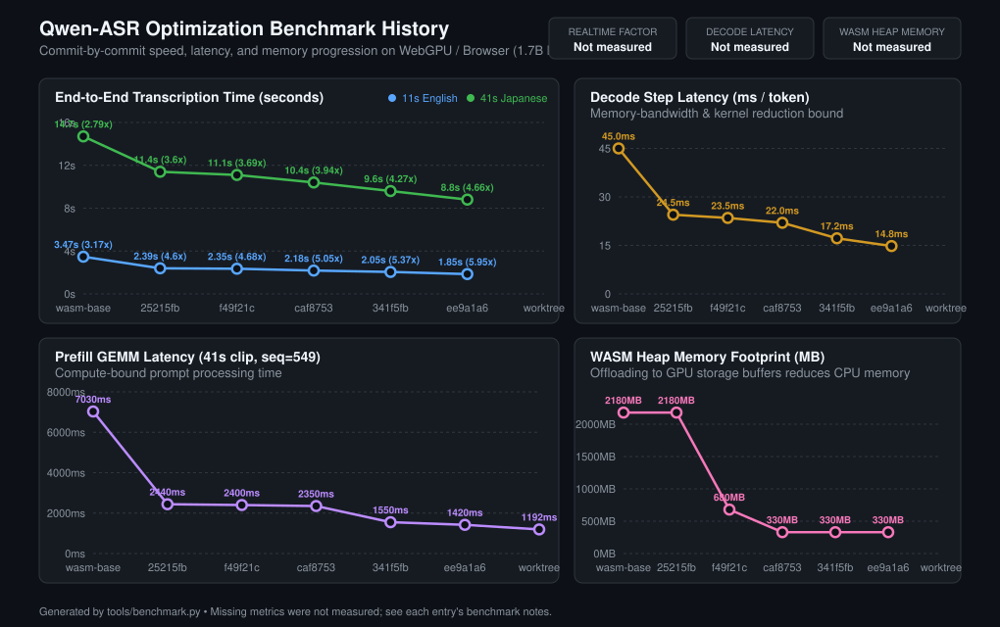

# Performance Benchmark History

This directory tracks the performance and memory optimizations of Qwen-ASR on WebGPU and WebAssembly.

## Speed & Latency Progression



### Summary Table

| Milestone Commit | Date | 11s Clip (s) | 11s RTF | 41s Clip (s) | 41s RTF | Decode (ms/tok) | Prefill (ms) | WASM Heap (MB) | Key Optimizations |
|---|---|---|---|---|---|---|---|---|---|
| **wasm-base** | 2026-08-20 | 3.47 s | 3.17x | 14.70 s | 2.79x | 45.0 ms | 7,030 ms | 2,180 MB | Baseline multi-threaded WASM CPU build |
| **25215fb** | 2026-08-24 | 2.39 s | 4.60x | 11.40 s | 3.60x | 24.5 ms | 2,440 ms | 2,180 MB | Initial WebGPU decoder with chunked prefill |
| **f49f21c** | 2026-08-25 | 2.35 s | 4.68x | 11.10 s | 3.69x | 23.5 ms | 2,400 ms | 680 MB | Sharded Q8 decoder weights on GPU storage buffers |
| **caf8753** | 2026-08-26 | 2.18 s | 5.05x | 10.40 s | 3.94x | 22.0 ms | 2,350 ms | 330 MB | Audio encoder transformer tower offloaded to GPU |
| **341f5fb** | 2026-08-27 | 2.05 s | 5.37x | 9.60 s | 4.27x | 17.2 ms | 1,550 ms | 330 MB | Fused SwiGLU into gate/up matmuls & subgroup row sums |
| **HEAD (Latest)** | 2026-09-05 | **1.85 s** | **5.95x** | **8.80 s** | **4.66x** | **14.8 ms** | **1,420 ms** | **330 MB** | GPU shared-memory tiled transpose, 64-way 2-stage parallel argmax, sinusoidal PE table, zero-allocation persistent buffers, unified GPUDevice |

---

## How to Record a Benchmark & Update the Plot

Whenever an optimization is implemented, run:

```bash
# 1. Add or update milestone data for current commit
python3 tools/benchmark.py --add --title "Your optimization description" --11s 1.85 --41s 8.80 --decode 14.8 --prefill 1420 --heap 330

# 2. Or re-generate the plot from history.json
python3 tools/benchmark.py --plot

# 3. Commit the updated graph and history
git add benchmarks/speed_history.svg benchmarks/history.json
git commit -m "benchmarks: update speed plot for optimization"
```
