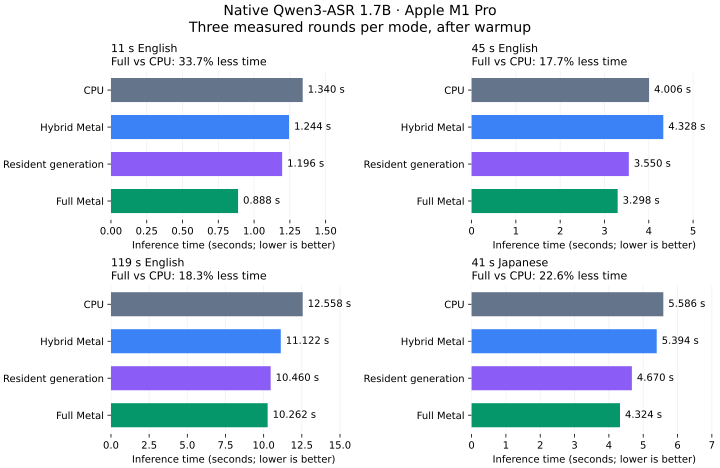

# Native resident Metal experiment

`make metal` now includes an opt-in `QWEN_METAL=full` path for both model
sizes. It runs the convolutional stem, encoder transformer, decoder prefill,
all decoder layers during generation, and token argmax on the GPU. The
default Metal mode remains the previously measured hybrid implementation.

## Measurements

Measured 2026-09-21 on Apple M1 Pro, 32 GiB RAM, macOS 26.6.2, eight CPU
threads, Qwen3-ASR-1.7B packed Q8, full-audio mode. The table shows inference
time medians from three measured rounds after a warmup for each mode, with
mode order rotated. No other inference jobs ran concurrently.

| Audio | CPU | Hybrid Metal | Resident generation | Full Metal | Full vs CPU | Full vs hybrid |
|---|---:|---:|---:|---:|---:|---:|
| 11 s English | 1.340 s | 1.244 s | 1.196 s | 0.888 s | 33.7% less time | 28.6% less time |
| 45 s English | 4.006 s | 4.328 s | 3.550 s | 3.298 s | 17.7% less time | 23.8% less time |
| 119 s English | 12.558 s | 11.122 s | 10.460 s | 10.262 s | 18.3% less time | 7.7% less time |
| 41 s Japanese, local clip | 5.586 s | 5.394 s | 4.670 s | 4.324 s | 22.6% less time | 19.8% less time |



All 64 executions, including warmups, produced the same transcript as each
clip's CPU reference. Required resident GPU stages completed on every run;
CPU fallbacks are rejected by the benchmark. The private Japanese clip is
not distributed. [Raw runs and validation](metal-full-m1-pro-2026-09-21.json)
include stage timings and GPU counters.

These are measurements of this machine and workload, not guaranteed gains.
CPU/hybrid timings varied noticeably: hybrid was slower than CPU for the
45 s clip in this run, despite its improvement in the previous hybrid-only
measurement. Compare modes within this table, retain the raw runs, and use
more repetitions for deployment decisions. This experiment supports keeping
activations on the GPU across layers; it does not show that moving every
small CPU operation to a separate GPU submission is faster.

A separate first-use process comparison for the 45 s English clip took
4.799 s CPU versus 3.695 s full Metal, including process/model/GPU setup;
the inference timers alone reported 4.693 s versus 3.586 s. This is one
comparison with model files already in the OS cache, not a cold-machine
median. Setup cost still needs to be included when evaluating one-shot use.

## What stays on the GPU

Intermediate activations remain in reusable Metal buffers across layers.
Q8 weight buffers reference the existing model allocation in unified memory.
Most dense products use GPU dequantization followed by MPS float32 GEMM.
Token generation reads Q8 weights directly, with float32 activations,
normalization, attention, fused gate/up activation, residual additions and
argmax in one command buffer per token. KV retains the CPU's float16 layout.

The first encoder convolution and decoder attention output projection use
explicit float32 Metal tiles. The resident MPS versions of these operations
produced NaNs in boundary/mode-switching tests on this M1 Pro. The explicit
tiles avoid those cases. MPS row counts divisible by 32 are split into two
disjoint ranges in the same command buffer; validation exposed nonfinite
results at those sizes as well. These are observed workarounds, not a claim that
MPS is generally incorrect. Results are also checked for nonfinite values
before committing encoder/prefill state, allowing CPU recomputation.

Audio loading, mel extraction, prompt assembly, token embedding lookup,
and the outer generation loop stay on the CPU. The CPU still waits once
per generated token. The encoder has two GPU submissions (stem and layers),
and prefill has one. This is not a persistent GPU-side token loop.

## Compatibility and memory

- `QWEN_METAL=0`: CPU; `=1` or unset: hybrid; `=decode`: resident generation
  with hybrid encoding/prefill; `=full`: resident encoder and decoder.
- The resident decoder supports Q8 layers plus a Q8 tied embedding/LM head
  (`--weights q8-lm`, including packed Q8 images). BF16/Q4 layouts and
  calibration fall back to existing kernels. The resident encoder accepts
  packed Q8 or original float32 weights.
- CPU KV ownership is unchanged. Metal creates temporary shared views per
  call, releases them before return, and commits the cache length only after
  successful GPU completion. CPU cache growth and streaming rollback retain
  their original semantics.
- Parallel segmented decoder batches keep the CPU/hybrid implementation;
  single-sequence segmented/streaming calls can use the resident path.
  Encoder debug taps keep the CPU path.
- Q8 weights are not duplicated. Scratch includes one dequantized matrix,
  activations, im2col and dense prefill attention scores. Original float32
  encoder weights have an additional Metal copy; packed Q8 only needs copies
  of its float32 convolution/normalization/bias tensors. Per-context buffers
  are released before the model allocations are freed.
- Non-Metal builds retain the existing implementation. Unavailable devices,
  unsupported shapes and failed commands fall back to CPU. Tests on this
  machine do not establish performance on other Apple GPUs or other vendors.

## Reproduce

```bash
make metal
MTL_DEBUG_LAYER=1 MTL_SHADER_VALIDATION=1 ./tools/test-metal-full qwen3-asr-1.7b-q8
MTL_DEBUG_LAYER=1 MTL_SHADER_VALIDATION=1 ./tools/test-metal-full qwen3-asr-0.6b

QWEN_METAL=full ./qwen_asr -d qwen3-asr-1.7b-q8 -i recording.wav
./tools/bench-metal-full qwen3-asr-1.7b-q8 recording.wav 3
```

The comparison tool loads the model once, warms each mode, then rotates
the order across three measured rounds. Round zero is excluded from medians.
It refuses timings if required GPU stage counters are zero. Transcript
exactness is recorded separately from speed; use the recognition regression
suite to evaluate numerical differences rather than assuming identical text.
First-use shader/pipeline preparation can change the result for a one-shot
CLI invocation. Warm medians do not include model loading.

## Recognition and state validation

Both 1.7B packed Q8 and 0.6B original weights passed the resident numerical
suite with Metal API and shader validation enabled. The cases cover encoder
chunk/window tails, decoder lengths around 32 and 128, suffix prefill,
unchanged cached prefixes, rollback, KV/RoPE growth to 1,100 tokens, and
disabled/Q4 fallback. Relative L2 errors were below the `0.003` tolerance.
GPU counters confirm execution rather than a silent CPU fallback.

The 1.7B full mode passed all 22 English fixtures at the existing normalized
character-error threshold of `0.15`, segmented conditioning, stdin streaming,
and both 0.6B stream-cache equivalence cases. The 18 synthetic Japanese
fixtures gave normalized CER `0.158361`, versus CPU `0.163898`; 16/18
transcripts were byte-identical. This small corpus does not establish a
general accuracy improvement. Float32 GPU matvecs and different reduction
orders can change close token decisions compared with the CPU's quantized
activation kernels. Weight precision and the stored KV format are unchanged.

Clean `make blas`, `make noblas`, and `make metal` builds passed. Both CPU
builds and the Metal binary running without GPU access returned the same JFK
transcript with empty stderr under `--silent`; the final binary is the Metal
build. This confirms local fallback/build behavior, not testing on a physical
non-Apple machine.

The standard 2 GiB browser WASM bundle was rebuilt. A freshly rebuilt,
temporary 4 GiB Node variant (needed to hold the complete 1.7B packed image)
passed all 22 WASM recognition fixtures, aggregate normalized error `0.0062`.
The distributed browser bundle retains its 2 GiB limit. The WebGPU adapter
and dispatch selection tests also passed 3/3; prior real-GPU WebGPU evidence
is recorded separately in [the WebGPU report](webgpu-metal.md).
